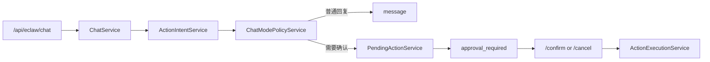

# ☕ Java Spring 微服务 — AI 平台业务后端

> 企业级 Java 微服务体系，承载业务逻辑（用户、商品、订单、通知），  
> 与 Python AI 服务（NLP / 推荐 / CV / MLOps）**分工协作，互补共存**。

---

## 🏗️ 架构设计

```
┌─────────────────────────────────────────────────────────────┐
│                       前端桌面 (:3000)                       │
│                 (Vue3 + qiankun)                             │
└───────────────────────────┬─────────────────────────────────┘
                            │
                            ▼
┌─────────────────────────────────────────────────────────────┐
│               ☕ Java 统一网关 (:8000)                        │
│         Spring Cloud Gateway + JWT 鉴权                     │
│  /api/users /api/business /api/dbadmin /api/nlp /api/cv...  │
└──┬───────┬───────┬───────┬───────┬───────┬───────┬──────────┘
   │       │       │       │       │       │       │
   ▼       ▼       ▼       ▼       ▼       ▼       ▼
┌─────┐ ┌─────┐ ┌─────┐ ┌─────┐ ┌─────┐ ┌─────┐ ┌─────┐
│User │ │Biz  │ │Notif│ │NLP  │ │Rec  │ │CV   │ │CI/CD│
│Svc  │ │Svc  │ │Svc  │ │Svc  │ │Svc  │ │Svc  │ │Svc  │
│:8101│ │:8102│ │:8103│ │:8001│ │:8002│ │:8003│ │:8104│
│Java │ │Java │ │Java │ │Python│ │Python│ │Python│ │Java │
│用户/│ │商品/│ │通知/│ │AI   │ │AI   │ │AI   │ │流水线│
│认证 │ │订单/│ │消息 │ │问答 │ │推荐 │ │视觉 │ │构建 │
│JWT  │ │DB管│ │MQ   │ │     │ │     │ │     │ │部署 │
└─────┘ └─────┘ └─────┘ └─────┘ └─────┘ └─────┘ └─────┘
                  │
                  │ DB Admin API
                  │ (直连 MySQL)
                  ▼
                          ┌──────────────────────────────┐
                          │   Infrastructure              │
                          │  MySQL(:3307) Redis(:6379)    │
                          │  RabbitMQ(:5672) MinIO(:9000) │
                          └──────────────────────────────┘

  注：所有服务（Java + Python）统一由 Java 网关代理，无 Python 网关。
  DB Admin API 由 Java business-service 直连 MySQL 提供。

## 📁 项目结构

```
java-spring-project/
├── pom.xml                        # 父 POM (Spring Boot 3.2 + Spring Cloud 2023)
├── .mvn/wrapper/                  # Maven Wrapper (无需本地装 Maven)
├── docker-compose.yml             # Docker Compose 编排
├── common/                        # 共享库
│   ├── dto/                       #   ApiResponse, PageRequest, PageResponse
│   └── exception/                 #   BusinessException
├── gateway-service/               # API 网关 (:8000)
│   ├── config/                    #   CORS, 限流
│   └── filter/                    #   JWT 全局鉴权过滤器
├── user-service/                  # 用户服务 (:8101)
│   ├── entity/                    #   User, AppPermission, UserPermission
│   ├── repository/                #   UserRepository
│   ├── service/                   #   UserService, AdminService
│   ├── controller/                #   UserController, AdminController, SettingsController
│   └── config/                    #   全局异常处理
├── business-service/              # 业务服务 (:8102)
│   ├── entity/                    #   Product, Order
│   ├── repository/                #   ProductRepository, OrderRepository
│   ├── service/                   #   BusinessService
│   ├── controller/                #   BusinessController, DbAdminController, HealthController
│   └── client/                    #   Feign 客户端 (调用通知服务)
├── eclaw-service/                 # Eclaw 智能体平台服务 (:8106)
│   ├── entity/                    #   Agent, Session, Skill, McpServer, ModelConfig
│   ├── repository/                #   AgentRepository, SessionRepository 等
│   ├── service/                   #   ChatService, ChatModePolicyService, PendingActionService
│   ├── controller/                #   EclawController
│   └── resources/sql/             #   Eclaw 模式与审批流 SQL 脚本
├── cicd-service/                  # CI/CD 流水线服务 (:8104)
├── oa-service/                    # OA 审批系统服务 (:8105)
│   ├── entity/                    #   Pipeline, Stage, Step, Execution, ExecStage, ExecStep, Artifact, CodeChange
│   ├── repository/                #   各实体 Repository
│   ├── service/                   #   CicdService
│   └── controller/                #   CicdController
└── notification-service/          # 通知服务 (:8103)
    ├── config/                    #   RabbitMQ 队列配置
    ├── listener/                  #   事件监听 (跨语言消费 Python 端消息)
    ├── service/                   #   站内信服务
    └── controller/                #   NotificationController
```

---

## 🚀 快速启动

### 前置条件

| 依赖 | 版本 | 说明 |
|------|------|------|
| Java | 21+ | `java -version` 确认 |
| MySQL | 8.0+ | 端口 3307 (与 AI-system 共用) |
| RabbitMQ | 3.x+ | 端口 5672 (与 AI-system 共用) |
| Redis | 7.x+ | 端口 6379 (与 AI-system 共用) |

### 本地开发

```bash
# 1. 使用 Maven Wrapper 编译（自动下载 Maven）
./mvnw clean install -DskipTests

# 2. 按顺序启动微服务

# 终端 1 — 用户服务
cd user-service && ../mvnw spring-boot:run

# 终端 2 — 业务服务
cd business-service && ../mvnw spring-boot:run

# 终端 3 — 通知服务
cd notification-service && ../mvnw spring-boot:run

# 终端 4 — 网关
cd gateway-service && ../mvnw spring-boot:run

# 终端 5 — Eclaw 智能体平台
cd eclaw-service && ../mvnw spring-boot:run
```

### Docker 部署

```bash
docker compose up -d --build
```

---

## 📡 API 接口

### 网关 (`localhost:8000`) — 统一入口

| 路径 | 转发至 | 类型 | 说明 |
|------|--------|------|------|
| `/api/users/**` | user-service:8101 | Java | 用户注册/登录/信息 |
| `/api/business/**` | business-service:8102 | Java | 商品/订单 CRUD |
| `/api/notifications/**` | notification-service:8103 | Java | 通知发送/消息查询 |
| `/api/nlp/**` | nlp-service:8001 | Python AI | 知识库问答 |
| `/api/recommend/**` | recommend-service:8002 | Python AI | 智能推荐 |
| `/api/cv/**` | cv-service:8003 | Python AI | 计算机视觉 |
| `/api/mlops/**` | mlops-service:8004 | Python AI | 模型训练/监控 |
| `/api/dbadmin/**` | business-service:8102 | Java | 数据库管理（表浏览/SQL查询） |
| `/api/cicd/**` | cicd-service:8104 | Java | CI/CD 流水线管理 |
| `/api/oa/**` | oa-service:8105 | Java | OA 审批请假系统 |
| `/api/eclaw/**` | eclaw-service:8106 | Java | 智能体平台（Agent、会话、模式、审批流） |
| `/api/health` | business-service:8102 | Java | 健康检查 |
| `/api/info` | business-service:8102 | Java | 服务信息 |

### 用户服务

| 方法 | 路径 | 说明 |
|------|------|------|
| POST | `/api/users/register` | 注册 |
| POST | `/api/users/login` | 登录 |
| GET  | `/api/users/me` | 当前用户 |

### 业务服务

| 方法 | 路径 | 说明 |
|------|------|------|
| GET  | `/api/business/products` | 商品列表 |
| GET  | `/api/business/products/{id}` | 商品详情 |
| POST | `/api/business/products` | 创建商品 |
| PUT  | `/api/business/products/{id}` | 更新商品 |
| DELETE| `/api/business/products/{id}` | 删除商品 |
| GET  | `/api/business/orders` | 我的订单 |
| GET  | `/api/business/orders/{no}` | 订单详情 |
| POST | `/api/business/orders` | 创建订单 |
| GET  | `/api/dbadmin/tables` | 获取所有表 |
| GET  | `/api/dbadmin/tables/{name}` | 获取表结构 |
| GET  | `/api/dbadmin/tables/{name}/data` | 分页查询数据 |
| POST | `/api/dbadmin/query` | 执行 SQL 查询 |
| GET  | `/api/health` | 健康检查 |
| GET  | `/api/info` | 服务信息 |

### 通知服务

| 方法 | 路径 | 说明 |
|------|------|------|
| POST | `/api/notifications/send` | 发送通知 |
| GET  | `/api/notifications/messages` | 我的消息 |

### CI/CD 流水线服务

| 方法 | 路径 | 说明 |
|------|------|------|
| GET  | `/api/cicd/pipelines` | 流水线列表 |
| GET  | `/api/cicd/pipelines/{id}` | 流水线详情 |
| POST | `/api/cicd/pipelines` | 创建流水线 |
| PUT  | `/api/cicd/pipelines/{id}` | 更新流水线 |
| DELETE | `/api/cicd/pipelines/{id}` | 删除流水线 |
| PUT  | `/api/cicd/pipelines/{id}/favorite` | 收藏/取消收藏 |
| POST | `/api/cicd/pipelines/{id}/execute` | 执行流水线 |
| GET  | `/api/cicd/executions` | 执行历史 |
| GET  | `/api/cicd/executions/{id}` | 执行详情 |
| GET  | `/api/cicd/executions/{id}/stages` | 执行阶段 |
| GET  | `/api/cicd/exec-stages/{id}/steps` | 阶段步骤 |
| GET  | `/api/cicd/executions/{id}/changes` | 代码变更 |
| GET  | `/api/cicd/executions/{id}/artifacts` | 产出物 |
| PUT  | `/api/cicd/executions/{id}/cancel` | 取消执行 |

### Eclaw 智能体平台服务

| 方法 | 路径 | 说明 |
|------|------|------|
| GET  | `/api/eclaw/agents` | Agent 列表 |
| POST | `/api/eclaw/agents` | 创建 Agent |
| PUT  | `/api/eclaw/agents/{id}` | 更新 Agent |
| GET  | `/api/eclaw/sessions` | 会话列表 |
| POST | `/api/eclaw/sessions` | 创建会话（继承 Agent 默认模式） |
| PUT  | `/api/eclaw/sessions/{id}` | 更新会话消息、模式、待审批状态 |
| POST | `/api/eclaw/chat` | 对话，返回普通消息或审批卡片 |
| POST | `/api/eclaw/sessions/{id}/pending-actions/{actionId}/confirm` | 确认并执行待审批动作 |
| POST | `/api/eclaw/sessions/{id}/pending-actions/{actionId}/cancel` | 取消待审批动作 |
| GET  | `/api/eclaw/models` | 模型列表 |
| GET  | `/api/eclaw/skills` | 技能列表 |
| GET  | `/api/eclaw/mcp-servers` | MCP 服务列表 |
| GET  | `/api/eclaw/logs` | 运行日志 |

#### 关键字段

| 对象 | 字段 | 说明 |
|------|------|------|
| `Agent` | `defaultChatMode` | Agent 默认对话模式，决定新会话初始化模式 |
| `Session` | `sessionMode` | 当前会话实际模式，只影响该会话 |
| `Session` | `pendingAction` | 当前待审批动作 JSON |
| `Session` | `pendingActionStatus` | 待审批状态，如 `waiting`、`cancelled`、`executed` |

#### `/api/eclaw/chat` 响应类型

Eclaw 对话接口现在不是单一文本响应，而是两类返回：

- `message`：普通 assistant 回复
- `approval_required`：检测到副作用动作，需要前端展示审批卡片

审批接口的返回也做了统一：

- confirm：返回 `status=executed` 和执行结果内容
- cancel：返回 `status=cancelled` 和取消提示内容

---

## 🧩 核心特性

### JWT 鉴权
- 网关 `AuthGlobalFilter` 统一拦截所有请求
- 白名单路径（login / register / health）免鉴权
- 解析后 Token 中的 `userId`/`username`/`role` 通过请求头透传

### Feign 服务调用
- `business-service` 通过 `NotificationClient` 调用 `notification-service`
- 实现服务间 RPC，链路完整

### RabbitMQ 跨语言通信
- Java 端声明 `ai.events` Topic Exchange（与 Python 端同 Exchange）
- 消费 `notification.*` 路由的消息
- Python 端发事件 → Java 端收 → 触发送通知

### 统一响应格式
所有接口返回标准 `ApiResponse<T>` 结构：
```json
{
  "code": 200,
  "message": "success",
  "data": { ... },
  "timestamp": "2026-07-15T12:00:00"
}
```

### Eclaw 对话模式与审批流

Eclaw 后端现在支持 4 种对话模式：

- `standard`
- `plan`
- `confirm`
- `plan_confirm`

其中：

- `Agent.defaultChatMode` 决定新会话默认模式
- `Session.sessionMode` 表示当前会话实际模式
- `Session.pendingAction` 与 `Session.pendingActionStatus` 负责保存待审批动作

副作用动作统一走以下链路：



典型副作用动作包括：

- 执行命令
- 调用 MCP
- 发起外部 HTTP 请求

当前模式要求确认时，后端不会直接执行动作，而是先返回审批卡片数据，等待前端确认后再进入执行网关。

### Eclaw 数据库脚本

本轮对话模式和审批流依赖以下 SQL：

- [2026-07-24-eclaw-chat-mode.sql](/Users/zhongzhihao/Desktop/java-spring-project/eclaw-service/src/main/resources/sql/2026-07-24-eclaw-chat-mode.sql)

主要新增字段：

- `eclaw_agents.default_chat_mode`
- `eclaw_sessions.session_mode`
- `eclaw_sessions.pending_action`
- `eclaw_sessions.pending_action_status`

---

## 🔗 与 Python AI 系统的关系

| | Python AI 系统 | Java 业务系统 |
|------|-------------|-------------|
| **定位** | AI 能力：NLP / 推荐 / CV / MLOps | 业务能力：用户 / 商品 / 订单 / 通知 / DB管理 |
| **网关** | 无独立网关 | **统一网关 :8000**（前端唯一入口） |
| **认证** | 无（由 Java 网关统一鉴权） | JWT Bearer（user-service 管理） |
| **数据库** | MySQL + Milvus（向量） | MySQL（同库，不同表） |
| **消息** | RabbitMQ 发送 AI 事件 | 消费事件触发通知 |
| **部署** | Docker Compose + K8s | Docker Compose |

**前端只需要记住一个端口 8000**。所有服务（Java + Python + DB管理）统一由 Java 网关代理，对前端透明。Python 网关已移除。

---

## 📋 OA 审批服务

### 功能特性

- 请假申请（年假、事假、病假、婚假、产假、调休）
- 一级审批流程（直属领导自动匹配）
- 审批仪表盘（待处理统计、已用年假、通知）
- 审批时间线（申请→审批→结果）

### 数据库表

| 表名 | 说明 |
|------|------|
| `oa_leave_types` | 假期类型（6种） |
| `oa_applications` | 审批申请 |
| `oa_approval_records` | 审批记录 |
| `oa_notifications` | 系统通知 |
| `oa_approvers` | 审批人配置 |
| `oa_approval_flows` | 审批流程模板 |
| `oa_wecom_contacts` | 企业微信联系人映射 |

### API 接口

| 方法 | 路径 | 说明 |
|------|------|------|
| GET | `/api/oa/leave-types` | 假期类型列表 |
| POST | `/api/oa/applications` | 提交申请 |
| GET | `/api/oa/applications` | 我的申请 |
| GET | `/api/oa/applications/{id}` | 申请详情 |
| POST | `/api/oa/applications/{id}/approve` | 审批通过 |
| POST | `/api/oa/applications/{id}/reject` | 审批驳回 |
| POST | `/api/oa/applications/{id}/cancel` | 撤回申请 |
| GET | `/api/oa/applications/pending` | 待我审批 |
| GET | `/api/oa/dashboard` | 审批仪表盘 |
| GET | `/api/oa/wecom/approver` | 我的审批人（含企微信息） |
| POST | `/api/oa/wecom/test-notify` | 测试企微通知 |

---

## 📱 企业微信集成

OA 审批系统通过**企业微信群机器人 Webhook**推送审批通知，无需配置 IP 白名单或回调 URL。

### 通知流程

```
提交申请 → 查找审批人 → 发送企微群机器人通知
审批完成 → 发送结果通知到企微群
```

### 配置

`oa-service/src/main/resources/application.yml`：

```yaml
wecom:
  enabled: true
  webhook-url: https://qyapi.weixin.qq.com/cgi-bin/webhook/send?key=***
```

### 消息格式

```markdown
## 📋 新审批待处理
> 申请人: 张三
> 假期类型: 年假
> 天数: 3天
> 编号: OA-20260717-001
> 请尽快审批处理
```

### 审批人配置

```sql
-- oa_approvers 表配置示例
INSERT INTO oa_approvers (user_id, user_name, approver_id, approver_name, is_default)
VALUES (1, '管理员', 2, '张三', 1);  -- 管理员 → 审批人：张三
```
